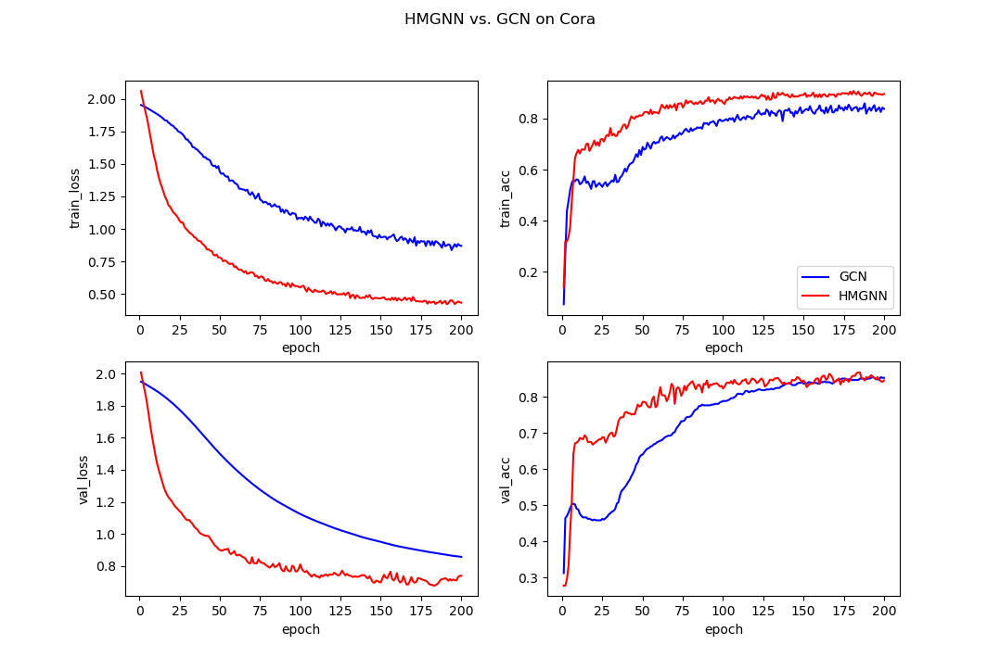

# HMGNN
TensorFlow implementation of Heterogeneous Multiple Mini-Graphs Neural Network  
- usage  
the task of (semi-supervised) classification of nodes in a graph  
- introduction  
We first introduce a kNN-based mechanism to combine diverse yet similar graphs and then the attention mechanism is 
presented to learn the importance of heterogeneous information. To enhance the representation of sparse and 
high-dimensional features, a residual style connection that embeds vanilla features into a hidden state is built.

## overview
The overall architecture of our proposal is displayed here.   
The left part illustrates kNN-based hyper-graphs generation given normal node features and their connected relation.   
We concatenate the feature matrix of the generated hyper-nodes from different sub-graphs to the input feature matrix 
to form the final feature representation that is fed into neural networks.   
The prediction is made based on the learned hidden state learned from the middle procedure.   
Different colors of nodes and edges indicate different types of nodes and relationships.

## requirements
tensorflow (>=1.12)  
pandas  
numpy

## quick-start
`python HMGNN.py`

### Data
The data used in quick-start is the Cora dataset.  
The Cora dataset consists of 2708 scientific publications classified into one of seven classes.  
The Cora dataset has saved as .npy in dir ./data
- labels.npy:    shape=(2708, 7)  
each publication is classified into one of seven classes.
- features.npy:  shape=(2708, 1433)  
each publication is described by a 0/1-valued word vector. The dictionary consists of 1433 words.
- edges_mat.npy: shape=(2, 10556)  
The graph consists of 10556 links, and each element in edges_mat.npy represents node_id.

### parameters explain
The parameters are defined in `hparam.py`. Main parameters conclude:
- feature dimensions: feature_dim=1433
- epochs=10
- learning_rate=0.0005
- whether or not using attention: attention=True
- whether or not using vanilla features: residual=True

### performance
We compare our proposal, HMGNN, with GCN, one of the classic graph convolutional network based approach.  
The training dataset is used to learn the model while the model selection
is based on the performance on the validation dataset.  
The accuracy measure is considered. Our proposed method achieves the better performance.  

|         |HMGNN|GCN  |
|  :---  |:---:|:---:|
|train_acc|0.908|0.860|
|val_acc  |0.867|0.854|

The table above is showed the accuracy of HMGNN and GCN. 
The pictures show the detailed loss and accuracy curve on training and validation dataset.

